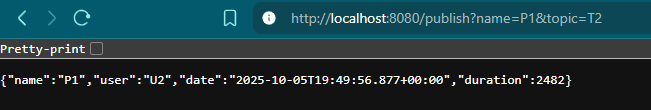
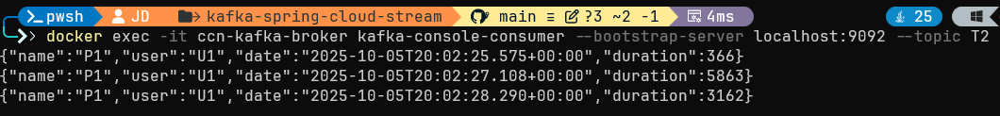
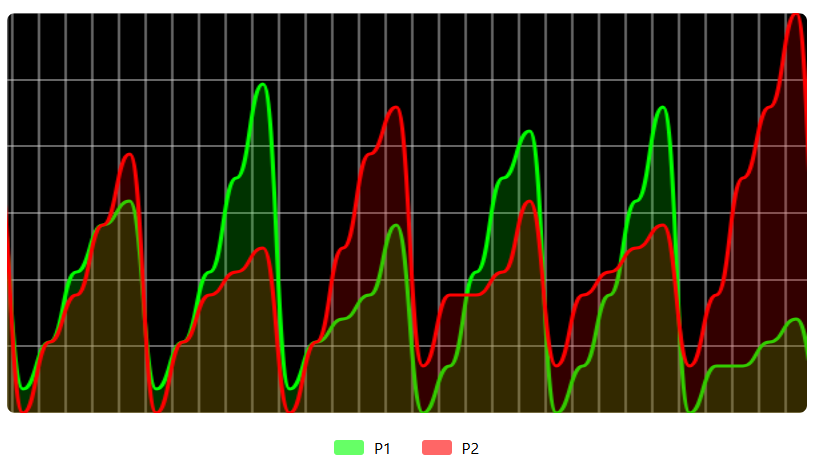
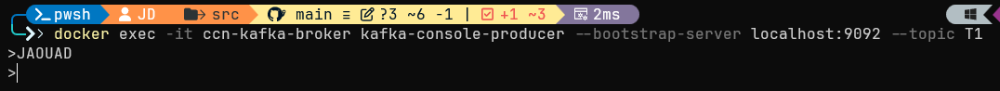
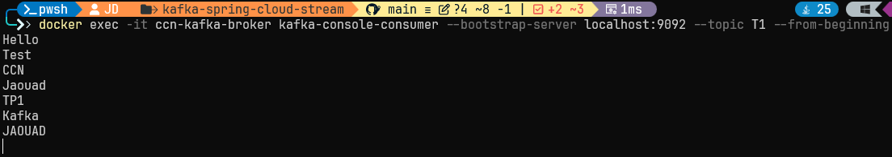
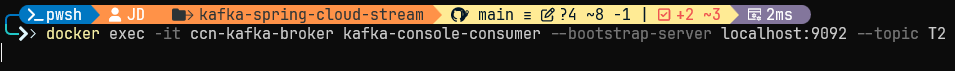
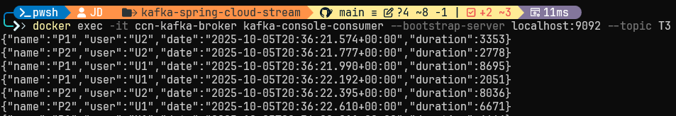
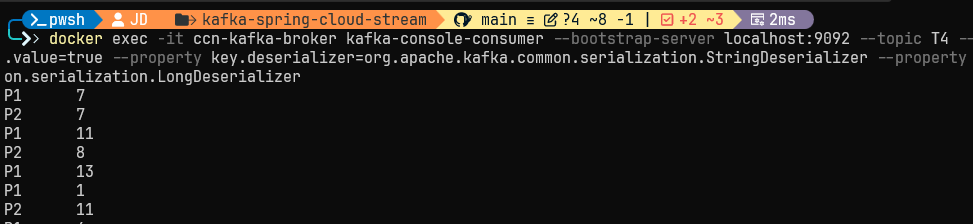

# Event Driven Architecture avec Apache Kafka et Spring Cloud Streams

[](https://www.oracle.com/java/)
[](https://spring.io/projects/spring-boot)
[](https://kafka.apache.org/)

## 📋 Description

Activité pratique démontrant l'implémentation d'une architecture événementielle (Event-Driven Architecture) utilisant **Apache Kafka** et **Spring Cloud Streams**. Cette activité illustre les concepts de streaming de données en temps réel, de traitement d'événements et d'analyse de données avec Kafka Streams.

## 🎯 Objectifs du Projet

- Comprendre les fondements de l'architecture événementielle
- Maîtriser Apache Kafka (Producer, Consumer, Topics)
- Utiliser Spring Cloud Streams pour l'abstraction de messaging
- Implémenter du traitement de flux en temps réel avec Kafka Streams
- Visualiser des analytics en temps réel dans une interface web

## 🏗️ Architecture


## 🚀 Technologies Utilisées

- **Java 25**
- **Spring Boot 3.x**
- **Spring Cloud Streams** - Abstraction pour le messaging
- **Apache Kafka** - Plateforme de streaming distribué
- **Kafka Streams** - Bibliothèque de traitement de flux
- **Docker & Docker Compose** - Conteneurisation
- **Chart.js** - Visualisation des données

## 📦 Prérequis

- Java JDK 25 ou supérieur
- Docker Desktop installé et démarré
- IntelliJ IDEA (recommandé) ou tout autre IDE Java
- Maven (intégré avec IntelliJ)

## 🔧 Installation et Démarrage

### 1. Cloner le repository

```bash
git clone https://github.com/jaouad4/kafka-spring-cloud-stream
cd kafka-spring-cloud-stream
```

### 2. Démarrer Kafka et Zookeeper avec Docker

```bash
docker-compose up -d
```


Vérifier que les conteneurs sont actifs :
```bash
docker ps
```


### 3. Démarrer l'application Spring Boot

Avec Maven :
```bash
mvn spring-boot:run
```

Ou depuis IntelliJ : *Run → Run 'Application'*

### 4. Tester l'application

L'application sera disponible sur `http://localhost:8080`

## 📝 Fonctionnalités Implémentées

### 1. Producer REST (Topic T2)

Envoyer un événement via HTTP :
```
GET http://localhost:8080/publish?name=P1&topic=T2
```

**Paramètres :**
- `name` : Nom de la page (P1, P2, etc.)
- `topic` : Topic Kafka de destination



### 2. Consumer Kafka

Consomme automatiquement les messages du topic T2 et les affiche dans la console.



### 3. Supplier (Auto-Producer vers T3)

Génère automatiquement des événements PageEvent toutes les 200ms vers le topic T3.

**Configuration dans `application.properties` :**
```properties
spring.cloud.stream.bindings.pageEventSupplier-out-0.producer.poller.fixed-delay=200
```

### 4. Kafka Streams - Analytics en Temps Réel

Traite le flux d'événements du topic T3 :
- **Filtrage** : Durée de visite > 100ms
- **Groupement** : Par nom de page (P1, P2)
- **Fenêtrage** : Fenêtre glissante de 5 secondes
- **Agrégation** : Comptage du nombre de visites
- **Output** : Résultats publiés sur topic T4

### 5. Interface Web de Visualisation

Accéder à : `http://localhost:8080/index.html`

Affiche en temps réel :
- Graphique à barres du nombre de visites par page
- Mise à jour toutes les secondes



## 🧪 Tests avec Kafka Console

### Tester le Producer Console

```bash
docker exec -it ccn-kafka-broker kafka-console-producer \
  --bootstrap-server localhost:9092 \
  --topic T1
```



### Tester le Consumer Console

```bash
docker exec -it ccn-kafka-broker kafka-console-consumer \
  --bootstrap-server localhost:9092 \
  --topic T1 \
  --from-beginning
```



### Consommer les messages du Topic T2

```bash
docker exec -it ccn-kafka-broker kafka-console-consumer \
  --bootstrap-server localhost:9092 \
  --topic T2
```



### Consommer les messages du Topic T3 (Supplier)

```bash
docker exec -it ccn-kafka-broker kafka-console-consumer \
  --bootstrap-server localhost:9092 \
  --topic T3
```



### Visualiser les résultats Kafka Streams (T4)

```bash
docker exec -it ccn-kafka-broker kafka-console-consumer \
  --bootstrap-server localhost:9092 \
  --topic T4 \
  --property print.key=true \
  --property print.value=true \
  --property key.deserializer=org.apache.kafka.common.serialization.StringDeserializer \
  --property value.deserializer=org.apache.kafka.common.serialization.LongDeserializer
```



## 📊 Structure du Projet

```
kafka-spring-cloud-stream/
├── src/
│   ├── main/
│   │   ├── java/
│   │   │   └── ma/
│   │   │       └── jaouad/
│   │   │           └── kafkaspringcloudstream/
│   │   │               ├── KafkaSpringCloudStreamApplication.java
│   │   │               ├── controllers/
│   │   │               │   ├── PageEventController.java
│   │   │               │   └── AnalyticsRestController.java
│   │   │               ├── events/
│   │   │               │   └── PageEvent.java
│   │   │               └── handlers/
│   │   │                   └── PageEventHandler.java
│   │   └── resources/
│   │       ├── application.properties
│   │       ├── static/
│   │       │   └── index.html
│   │       └── templates/
│   └── test/
│       └── java/
│           └── ma/
│               └── jaouad/
│                   └── kafkaspringcloudstream/
│                       └── KafkaSpringCloudStreamApplicationTests.java
├── assets/
│   ├── architecture-diagram.png
│   ├── rest-api-request.png
│   ├── kafka-streams-output.png
│   └── web-interface.png
├── .idea/
├── .mvn/
├── target/
├── .gitattributes
├── .gitignore
├── docker-compose.yml
├── HELP.md
├── mvnw
├── mvnw.cmd
├── pom.xml
└── README.md

```

## 🔍 Concepts Clés

### PageEvent

Record Java représentant un événement de visite de page :
```java
public record PageEvent(
    String name,      // Nom de la page (P1, P2)
    String user,      // Utilisateur (U1, U2)
    Date date,        // Date de la visite
    long duration     // Durée de visite en ms
) {}
```

### Spring Cloud Stream Bindings

- **Consumer** : `<functionName>-in-<index>`
- **Producer/Supplier** : `<functionName>-out-<index>`
- **Function** : Input et Output définis

### Kafka Streams Operations

- **filter()** : Filtrer les événements selon une condition
- **map()** : Transformer les événements
- **groupByKey()** : Grouper par clé
- **windowedBy()** : Définir une fenêtre temporelle
- **count()** : Compter les événements dans chaque groupe/fenêtre

## 📈 Démonstration Complète

### Scénario de Test Complet

1. **Démarrage des services**

<!-- [Screenshot : Docker Desktop avec tous les conteneurs démarrés] -->

2. **Publication d'événements via REST**

<!-- [Screenshot : Multiples onglets de navigateur envoyant des requêtes publish] -->

3. **Consommation en temps réel**

<!-- [Screenshot : 3 terminaux affichant simultanément T2, T3 et T4] -->

4. **Visualisation Web**

<!-- [Screenshot : Page web finale avec le graphique animé montrant les statistiques en temps réel] -->

## 🐛 Troubleshooting

### Docker ne démarre pas
```bash
# Vérifier que Docker Desktop est lancé
docker info

# Redémarrer les conteneurs
docker-compose down
docker-compose up -d
```

### Port 9092 déjà utilisé
Modifiez le port dans `docker-compose.yml` et `application.properties`.

### Les messages n'arrivent pas
Vérifiez que les topics et bindings correspondent dans la configuration.

### Erreur au démarrage de l'application
```bash
# Nettoyer et recompiler
mvn clean install
```

<!-- [Screenshot : Console Maven montrant "BUILD SUCCESS"] -->

## 📚 Ressources

- [Vidéo du demo - Prof. Mohamed YOUSSFI](https://www.youtube.com/watch?v=8uY7JE_X_Fw)
- [Apache Kafka Documentation](https://kafka.apache.org/documentation/)
- [Spring Cloud Stream](https://spring.io/projects/spring-cloud-stream)
- [Kafka Streams Documentation](https://kafka.apache.org/documentation/streams/)

## 👨‍🎓 Auteur

- **Salah-Eddine JAOUAD**  
- Activité Pratique N°1 - Event Driven Architecture  
- **Professeur :** Mohamed YOUSSFI

## 📄 Licence

Ce projet est réalisé dans un cadre académique.